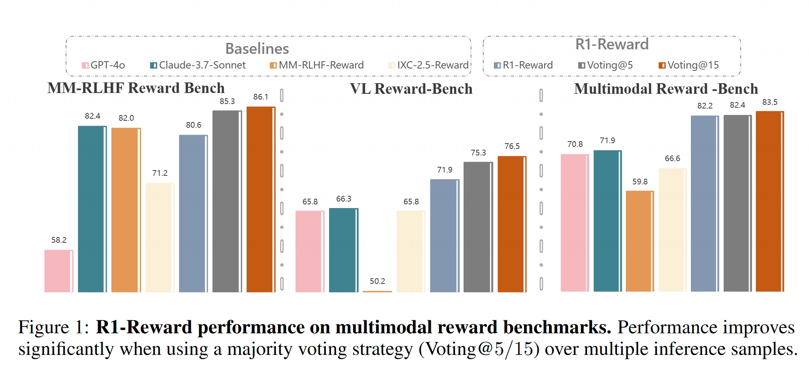

<p align="center" width="90%">

</p>

<font size=7><div align='center' >  
[[📖 arXiv Paper](https://arxiv.org/abs/2502.10391)] 
[[📊 R1-Reward Model](https://huggingface.co/yifanzhang114/R1-Reward)] 
[[📝 R1-Reward Data](https://huggingface.co/datasets/yifanzhang114/R1-Reward-RL)] 
</div></font>

## Training Multimodal Reward Model Through Stable Reinforcement Learning

**R1-Reward** is a comprehensive project focused on enhancing multimodal reward modeling through reinforcement learning. We introduce the **StableReinforce** algorithm and release the **R1-Reward model**, achieving significant performance improvements on established benchmarks.

*   **R1-Reward Model:** A state-of-the-art (SOTA) multimodal reward model demonstrating substantial gains (Voting@15):
    *   **13.5%** improvement on VL Reward-Bench.
    *   **3.5%** improvement on MM-RLHF Reward-Bench.
    *   **14.6%** improvement on Multimodal Reward Bench.
*   **StableReinforce Algorithm:** A novel reinforcement learning method that enhances the Reinforce++ approach by improving training loss stability, advantage estimation, and reward function design.
*   **Open-Source Resources:** We provide the R1-Reward model, the R1-Reward RL training dataset, and inference code for IXC-Reward，MM-RLHF Reward and R1-Reward on the three benchmarks in Figure 1.

<p align="center" width="100%">

</p>

## Table of Contents

1.  [Installation](#1-installation)
2.  [Data Preparation](#2-data-preparation)
3.  [Training with StableReinforce](#3-training-with-stablereinforce)
4.  [Evaluation](#4-evaluation)
5.  [Usage Example: How to Use R1-Reward](#5-usage-example-how-to-use-r1-reward)
6.  [Citation](#6-citation)
7.  [Related Projects](#7-related-projects)


## 1. Installation

### **1.1. Clone the Repository:**
```bash
git clone https://github.com/yfzhang114/r1_reward
cd r1_reward
```
### **1.2. Create Conda Environment and Install Dependencies:**

```bash
conda create -n r1_reward python=3.10 -y
conda activate r1_reward
pip install -e .[vllm]
pip install flash_attn --no-build-isolation
```

---

## 2. Data Preparation

**2.1. Download Data:**
Obtain the [📊 R1-Reward-RL Data](https://huggingface.co/datasets/yifanzhang114/R1-Reward-RL).

**2.2. Process Data and Images:**
Process the dataset. For each sample, ensure the corresponding image is saved locally. Update the dataset files (e.g., `.jsonl` files) to include the correct local path to the image for each sample. The image path should be referenced within the `content` list as shown below:

*Example Image Path Entry:*
```json
{
  "type": "image",
  "image": "/path/to/your/images/edouard-vuillard_the-cake-shop.jpg" // <-- Update this path
}
```

**2.3. Training Data Format:**
The training data should follow this JSON structure, where `message` contains the prompt and evaluation task, and `answer` indicates the preferred response index (`"1"` or `"2"`):

```json
{
  "message": "[{\"role\": \"user\", \"content\": [{\"type\": \"text\", \"text\": \"You are a highly skilled and impartial evaluator... <evaluation prompt text> ...#### [Response 2]:\\nThe artwork is a print...\"}, {\"type\": \"image\", \"image\": \"/mmu_mllm_hdd/yfzhang/data/RLAIF-V-image/edouard-vuillard_the-cake-shop.jpg\"}]}]", // Note: Full prompt text truncated for brevity
  "question": "Give a comprehensive description of this artwork, from its visual elements to its conceptual meaning.",
  "answer": ["<answer>2</answer>"] // Indicates Response 2 is preferred
}
```
*(Please refer to the dataset for the full `message` text format)*

## 3. Training with StableReinforce

Follow these steps to train your reward model using the StableReinforce algorithm:

**3.1. Configure Paths:**

In your training script or environment settings, define the following paths:

* `DATASET`: Specify the path to your training dataset.
* `SAVE_PATH`: Specify the directory where the trained model should be saved.

**3.2. Configure the Consistency Judge:**

To utilize an external model for calculating the Consistency Reward, configure its endpoint:

* Open the file: `openrlhf/models/remote_rm/math_verifier_mllm.py`
* Locate the `openai_api_base` variable (around line 181).
* Set its value to the base URL of your external reward model's API endpoint. For example:
    ```python
    # Used to calculate the Consistency Reward
    openai_api_base = "[http://10.82.120.96:8000/v1](http://10.82.120.96:8000/v1)"
    ```

**3.3. Start Training:**

Execute the training script from your terminal:

```bash
sh scripts/train.sh
```

## 4. Evaluation

The evaluation scripts are located in the `inference/Multimodal-Reward` directory.

**General Evaluation Steps:**

1.  **Download Benchmark Data:**
    *   Obtain the image/video data for the benchmark datasets (e.g., VL Reward-Bench, MM-RLHF Reward-Bench, Multimodal Reward Bench) as specified by their original sources.
    *   For the Multimodal-Reward benchmark, you can use the provided script `inference/Multimodal-Reward/0_download_data.py` to download necessary metadata and process images.

2.  **Prepare Data Files:**
    *   For MM-RLHF-Reward and VL-Reward-Bench, we provide pre-formatted `.jsonl` files. **Crucially, you must update the image folder paths** within these files to match the location where you stored the downloaded images.
    *   Ensure all data files reference the correct local paths for images/videos.

3.  **Run Evaluation Scripts:**
    *   Navigate to the appropriate subdirectory within `inference/`.
    *   Execute the relevant evaluation script. These scripts will load the model, process the benchmark data, generate reward scores, and calculate the final accuracy.

## 5. Usage Example: How to Use R1-Reward

Here's a Python snippet demonstrating how to load and use the R1-Reward model for inference:

```python
import torch
import re
import os
import numpy as np
from transformers import Qwen2_5_VLForConditionalGeneration, AutoTokenizer, AutoProcessor, AutoConfig
from qwen_vl_utils import process_vision_info # Ensure this utility script is available

# --- Configuration ---
# Replace with your actual model path (local or HF Hub) and image/video folders
MODEL_PATH = "yifanzhang114/R1-Reward"
IMAGE_FOLDER = "/path/to/your/images"
VIDEO_FOLDER = "/path/to/your/videos" # Example path for video frames

# --- 1. Load Model and Processor ---
print("Loading model and processor...")
config = AutoConfig.from_pretrained(MODEL_PATH)
model = Qwen2_5_VLForConditionalGeneration.from_pretrained(
    MODEL_PATH,
    torch_dtype=torch.bfloat16,
    device_map="auto", # Automatically distributes model across available GPUs
    attn_implementation="flash_attention_2", # Use Flash Attention if available
    config=config
)
# Increase max_pixels if dealing with very high-resolution images/videos
processor = AutoProcessor.from_pretrained(MODEL_PATH, max_pixels=1003520)
print("Model and processor loaded.")

# --- 2. Define Helper Function for Prompt Formatting ---
def make_conv_rm(prompt, chosen, rejected, has_image=True):
    prompt_template = (
        "You are a highly skilled and impartial evaluator tasked with comparing two responses generated by a Large Multimodal Model for a given question. "
        "- Start with a thorough, side-by-side comparative analysis enclosed within <think> and </think> tags. A tie is not permitted; you must choose a better option.\n\n"
        "- Conclude with a single numeric choice enclosed within <answer> and </answer> tags:\n"
        "  - Output \"1\" if Response 1 is better.\n"
        "  - Output \"2\" if Response 2 is better.\n\n"
        "###### **Input:**  \n"
        "###### [Question]:\n{question}  \n\n"
        "###### [Response 1]:\n{answer1}  \n\n"
        "###### [Response 2]:\n{answer2}  \n\n"
        "###### **Output Format (strictly follow):**  \n"
        "<think>Your detailed comparative analysis goes here</think><answer>1/2</answer>"
    )
    formatted_prompt = prompt_template.format(question=prompt, answer1=chosen, answer2=rejected)
    return formatted_prompt

# --- 3. Prepare Input Data (Example) ---
# Example question and responses (replace with your actual data)
question = "Describe the main subject of the image."
response1 = "A colorful bird sitting on a branch."
response2 = "A detailed view of a parrot with vibrant blue and yellow feathers perched on a wooden stick."
image_file = "parrot.jpg" # Example image filename
video_dir = "bird_video_frames" # Example directory containing video frames

# Format the text prompt
formatted_question_prompt = make_conv_rm(question, response1, response2)

# --- 4. Prepare Multimodal Input (Image or Video) ---

# Example for Image Input:
image_path = os.path.join(IMAGE_FOLDER, image_file)
messages = [
    {
        "role": "user",
        "content": [
            {"type": "image", "image": image_path},
            {"type": "text", "text": formatted_question_prompt},
        ],
    }
]

# # Example for Video Input (Uncomment to use):
# frame_folder_path = os.path.join(VIDEO_FOLDER, video_dir)
# frame_files = sorted([os.path.join(frame_folder_path, f) for f in os.listdir(frame_folder_path) if os.path.isfile(os.path.join(frame_folder_path, f))])
# if frame_files:
#     sample_frames = 32 # Number of frames to sample
#     total_frames = len(frame_files)
#     sample_indices = np.linspace(0, total_frames - 1, sample_frames, dtype=int)
#     sampled_frame_paths = [frame_files[i] for i in sample_indices]
#     messages = [
#         {
#             "role": "user",
#             "content": [
#                 {"type": "video", "video": sampled_frame_paths}, # Pass list of frame paths
#                 {"type": "text", "text": formatted_question_prompt},
#             ],
#         }
#     ]
# else:
#     print(f"Warning: No frames found in {frame_folder_path}")
#     # Handle case where video frames are missing, perhaps fallback to text-only or skip
#     messages = [ # Fallback example: Text only
#         {
#             "role": "user",
#             "content": [{"type": "text", "text": formatted_question_prompt}],
#         }
#     ]


# --- 5. Process Inputs for Model ---
print("Processing inputs...")
# Apply chat template and process vision info
text = processor.apply_chat_template(messages, tokenize=False, add_generation_prompt=True)
image_inputs, video_inputs = process_vision_info(messages) # Extracts image/video data

# Tokenize and prepare final input dictionary
inputs = processor(
    text=[text],
    images=image_inputs,
    videos=video_inputs,
    padding=True,
    return_tensors="pt",
)
inputs = inputs.to("cuda") # Move inputs to GPU
print("Inputs ready.")

# --- 6. Generate Reward Model Output ---
print("Generating model output...")
with torch.inference_mode():
    # Generate the reward model's evaluation (including thought process and final answer)
    generated_ids = model.generate(**inputs, max_new_tokens=1024) # Adjust max_new_tokens if needed

# Decode the generated output, removing the input prompt tokens
generated_ids_trimmed = [
    out_ids[len(in_ids):] for in_ids, out_ids in zip(inputs.input_ids, generated_ids)
]
output_text = processor.batch_decode(
    generated_ids_trimmed, skip_special_tokens=True, clean_up_tokenization_spaces=False
)

critic_output = output_text[0] # Get the generated text for the first sample
print(f"Model Output:\n{critic_output}")

# --- 7. Extract Reward Score ---
rewards = [0.5, 0.5] # Default to tie/uncertain if extraction fails
try:
    # Use regex to find the numeric answer within <answer> tags
    content_match = re.search(r"<answer>(.*?)</answer>", critic_output, re.DOTALL | re.IGNORECASE)
    if content_match:
        student_answer = content_match.group(1).strip()
    else:
        # Fallback: Find the last digit '1' or '2' in the output as a guess
        last_match = re.search(r"[12](?!.*[12])", critic_output)
        student_answer = last_match.group(0) if last_match else None

    if student_answer is not None:
        choice = int(student_answer)
        if choice == 1:
            rewards = [1.0, 0.0] # Response 1 is better
            print("Reward assigned: Response 1 > Response 2")
        elif choice == 2:
            rewards = [0.0, 1.0] # Response 2 is better
            print("Reward assigned: Response 2 > Response 1")
        else:
            print(f"Warning: Extracted answer '{student_answer}' is not 1 or 2. Defaulting rewards.")
    else:
         print("Warning: Could not extract answer (no <answer> tag or trailing 1/2). Defaulting rewards.")

except Exception as e:
    print(f"Error extracting reward: {e}. Defaulting rewards.")

print(f"Final Rewards: {rewards}") # rewards[0] for Response 1, rewards[1] for Response 2

```
   
## Citation

If you find R1-Reward or StableReinforce useful in your research or applications, please cite our paper:

```bibtex
@article{zhang2025mm,
  title={MM-RLHF: The Next Step Forward in Multimodal LLM Alignment},
  author={Zhang, Yi-Fan and Yu, Tao and Tian, Haochen and Fu, Chaoyou and Li, Peiyan and Zeng, Jianshu and Xie, Wulin and Shi, Yang and Zhang, Huanyu and Wu, Junkang and others},
  journal={arXiv preprint arXiv:2502.10391},
  year={2025}
}
```

## Related Projects
Explore other related work from our team:


- [MM-RLHF: The Next Step Forward in Multimodal LLM Alignment](https://mm-rlhf.github.io/)
- [MME-RealWorld: Could Your Multimodal LLM Challenge High-Resolution Real-World Scenarios that are Difficult for Humans?](https://github.com/yfzhang114/MME-RealWorld)
- [MME-Survey: A Comprehensive Survey on Evaluation of Multimodal LLMs](https://arxiv.org/abs/2411.15296)
- [Beyond LLaVA-HD: Diving into High-Resolution Large Multimodal Models](https://github.com/yfzhang114/SliME)
- [VITA-1.5: Towards GPT-4o Level Real-Time Vision and Speech Interaction](https://github.com/VITA-MLLM/VITA)
